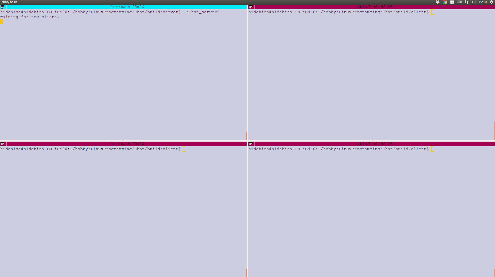
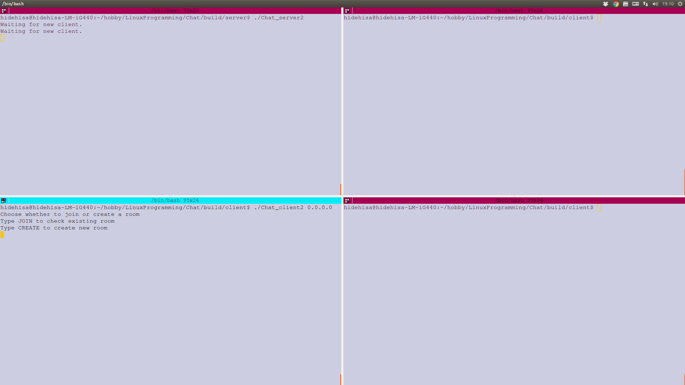
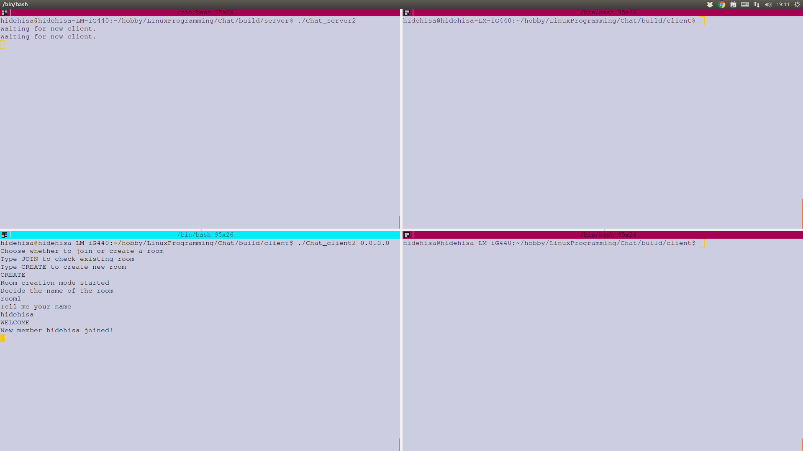
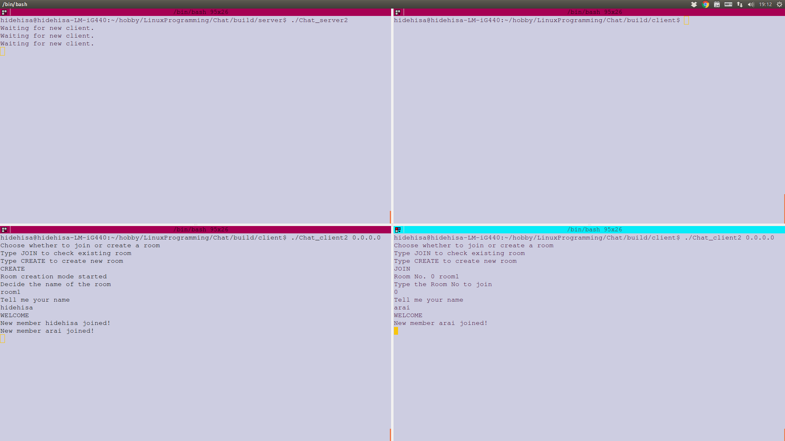
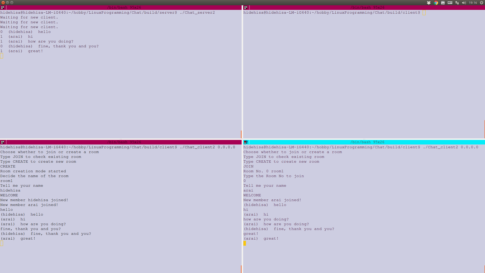
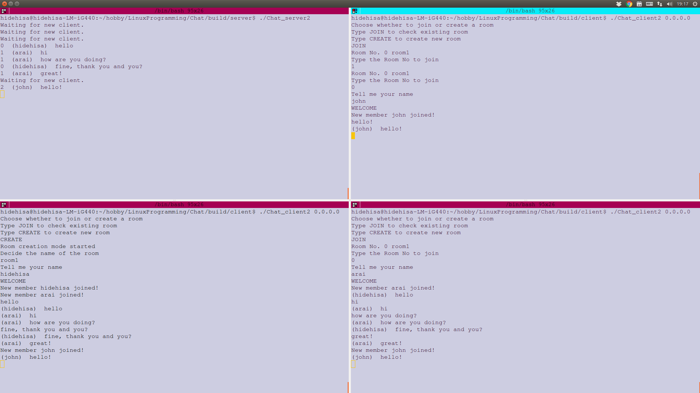
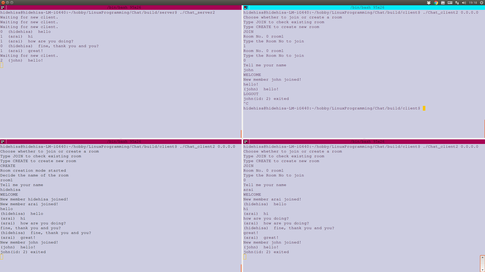
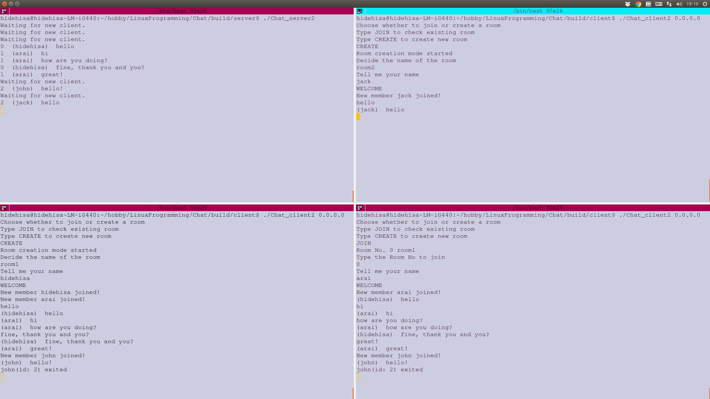
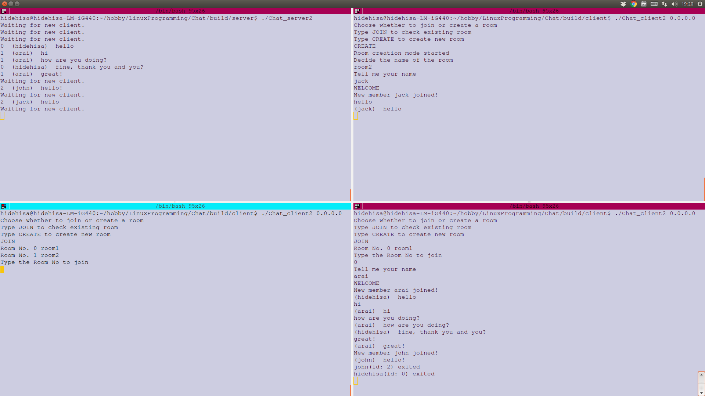
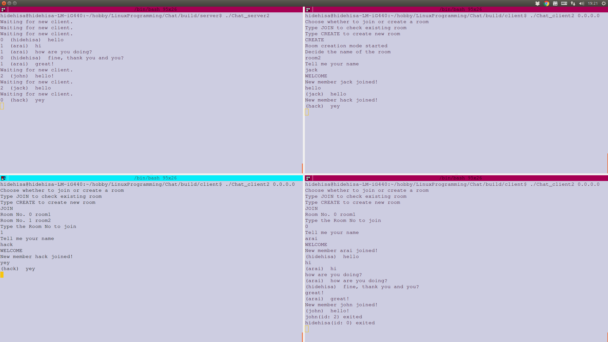

## Chatツールの作成

### 何を作ったのか
CUIで動作するチャットツールを作りました。機能としては、接続した際に参加するroomを選択する、あるいは参加するroomを作成することができるようにしルーム内での会話は別のルームには届かないようにしている点が大きな特徴です。

サーバ側とクライアント側にそれぞれプログラムを用意し、マルチスレッドにより並行サーバを実現しています。

### C言語プログラム

#### サーバ側

```c
#include <stdio.h>
#include <stdlib.h>
#include <string.h>
#include <sys/socket.h>
#include <sys/types.h>
#include <pthread.h>
#include <netinet/in.h>
#include <unistd.h>
#include <netdb.h>
#include <jmorecfg.h>

#define PORT "10081"
#define MAX_CLIENT 10
#define MAX_ROOM 10
#define BUF_SIZE 1024

#define BLACK "\x1b[0;30m"
#define RED "\x1b[0;31m"

typedef struct {
    char name[64];
    int fd;
    int no;
    int roomNo;
} Mem;

typedef struct {
    char name[64];
    int memList[MAX_CLIENT];
    int roomNo;
} Room;

Mem member[MAX_CLIENT];
Room room[MAX_ROOM];
int open_account[MAX_CLIENT];

int tcp_listen(void);
static void *room_select(void *id);
void subStr(char *out, char *str, int start, size_t nchar);
void forceSend(int fd, char *buffer);
void sendMsg(int roomNo, char *buffer);
void throwMemList(int roomNo, int fd);
void lineTrim(char *str);

int main(int argc, char **argv) {
    int sock;
    pthread_t tid[MAX_CLIENT];
    sock =tcp_listen();
    if (sock < 0) {
        perror("tcp_listen");
        exit(EXIT_FAILURE);
    }

    for (int i = 0; i < MAX_CLIENT; ++i) {
        member[i].fd = 0;
        member[i].no = 0;
        member[i].roomNo = -1;
        open_account[i] = 0;
    }

    for (int i = 0; i < MAX_ROOM; ++i) {
        room[i].roomNo = -1;
        for (int j = 0; j < MAX_CLIENT; ++j) {
            room[i].memList[j] = -1;
        }
    }

    while (1) {
        int client_sock;

        struct sockaddr_storage saddr;
        socklen_t len = sizeof(saddr);

        printf("Waiting for new client.\n");
        client_sock = accept(sock, (struct sockaddr *)&saddr, &len);
        if (client_sock < 0) {
            perror("accept");
            break;
        }
        //空いているアカウントを探す
        int id = -1;
        for (int i = 0; i < MAX_CLIENT; ++i) {
            if (open_account[i] == 0) {
                id = i;
                open_account[i] = client_sock;
                break;
            }
        }
        if (id == -1) {
            char buffer[BUF_SIZE];
            sprintf(buffer, "Sorry, member is full now\nTry to connect again after a while...\n");
            forceSend(client_sock, buffer);
            close(client_sock);
        }

        member[id].no = id;
        member[id].fd = client_sock;
        if (pthread_create(&tid[id], NULL, room_select, (void *)id) != 0) {
            perror("pthread_create");
            break;
        }
    }

    for (int j = 0; j < MAX_CLIENT; ++j) {
        pthread_join(tid[j], NULL);
    }
    close(sock);
    return 0;
}

int tcp_listen(void) {
    int err, sock;
    int on = 1;
    struct addrinfo hints;
    struct addrinfo* res = NULL;
    struct addrinfo* ai;

    memset(&hints, 0, sizeof(hints));
    hints.ai_family = AF_INET6;
    hints.ai_socktype = SOCK_STREAM;
    hints.ai_flags = AI_PASSIVE;

    err = getaddrinfo(NULL, PORT, &hints, &res);
    if (err != 0) {
        fprintf(stderr, "getaddrinfo: %s\n", gai_strerror(err));
        return -1;
    }

    ai = res;
    sock = socket(ai->ai_family, ai->ai_socktype, ai->ai_protocol);
    if (sock < 0) {
        perror("socket");
        return -1;
    }

    if (setsockopt(sock, SOL_SOCKET, SO_REUSEADDR, &on, sizeof(on)) < 0) {
        perror("setsockopt");
        return -1;
    }

    if (bind(sock, ai->ai_addr, ai->ai_addrlen) < 0) {
        perror("bind");
        return -1;
    }

    if (listen(sock, MAX_CLIENT) < 0) {
        perror("listen");
        return -1;
    }
    freeaddrinfo(res);
    return sock;
}

static void *room_select(void *id) {
    ssize_t n;
    int member_id = (int)id;
    int fd = member[member_id].fd;

    char buffer[BUF_SIZE];
    char receive[BUF_SIZE];
    select:
    sprintf(buffer, "Choose whether to join or create a room\n"
                    "Type JOIN to check existing room\n"
                    "Type CREATE to create new room\n");
    forceSend(fd, buffer);

    //check the mode
    while ((n = read(fd, receive, sizeof(receive))) < 0);
    char out[n+1];
    subStr(out, receive, 0, (size_t)n);

    if (strcmp(out, "JOIN\n") == 0) {
        int roomNo;
        join: printf("");
        int existRoom = 0;
        for (int i = 0; i < MAX_ROOM; ++i) {
            if (room[i].roomNo >= 0) {
                existRoom++;
                sprintf(buffer, "Room No. %d %s",room[i].roomNo, room[i].name);
                forceSend(fd, buffer);
            }
        }

        //roomがひとつでも存在した場合
        if (existRoom > 0) {
            sleep(1);
            sprintf(buffer, "Type the Room No to join\n");
            forceSend(fd, buffer);
            //Read room no.
            do {
                while ((n = read(fd, receive, sizeof(buffer))) < 0);
                if (n > 2) {
                    sprintf(buffer, "Please type room no\n");
                    forceSend(fd, buffer);
                    n = -1;
                }
            } while (n < 0);
            roomNo = receive[0] - 48;
            for (int i = 0; i < MAX_ROOM; ++i) {
                if (roomNo == room[i].roomNo) {
                    member[member_id].roomNo = roomNo;
                    for (int j = 0; j < MAX_CLIENT; ++j) {
                        if (room[i].memList[j] == -1) {
                            room[i].memList[j] = member[member_id].no;
                            //指定されたroomに参加したのでchat開始
                            goto chat;
                        }
                    }
                }
            }
            //送られてきたroom noに合致するroomがなかったので存在するroom noを再送
            goto join;
        } else {
            sprintf(buffer, "No room exists, please create room\n");
            forceSend(fd, buffer);
            sleep(1);
            goto create; //Room作成モードに飛ぶ
        }
    } else if (strcmp(out, "CREATE\n") == 0) {
        create:
        sprintf(buffer, "Room creation mode started\n"
                        "Decide the name of the room\n");
        forceSend(fd, buffer);
        memset(receive, '\0', sizeof(receive));
        do {
            while ((n = read(fd, receive, sizeof(receive))) < 0);
            if (n > sizeof(room[0].name)) {
                sprintf(buffer, "Size of the room name must be under %d bytes\n", (int)sizeof(room[0].name));
                forceSend(fd, buffer);
                n = -1;
            }
        } while (n < 0);

        for (int i = 0; i < MAX_ROOM; ++i) {
            if (room[i].roomNo == -1) {
                room[i].roomNo = i;
                subStr(room[i].name, receive, 0, (size_t)n);
                member[member_id].roomNo = i;
                for (int j = 0; j < MAX_CLIENT; ++j) {
                    if (room[i].memList[j] == -1) {
                        room[i].memList[j] = member[member_id].no;
                        goto chat;
                    }
                }
            }
        }
    } else goto select; //JOINまたはCREATE以外を書き込むとモード選択に戻される。
    chat:
    //名前を決定する部分
    sleep(1);
    sprintf(buffer, "Tell me your name\n");
    forceSend(fd, buffer);
    memset(receive, '\0', sizeof(receive));
    do {
        while ((n = read(fd, receive, sizeof(receive))) < 0);
        if (n > sizeof(member[member_id].name)) {
            sprintf(buffer, "Size of your name must be under %d bytes\n", (int) sizeof(member[member_id].name));
            forceSend(fd, buffer);
            n = -1;
        }
    } while (n < 0);

    sleep(1);
    memset(buffer, '\0', sizeof(buffer));
    sprintf(buffer, "WELCOME\n");
    forceSend(fd, buffer);
    sleep(1);

    lineTrim(receive);
    subStr(member[member_id].name, receive, 0, (size_t)n-1);
    sprintf(buffer, "New member %s joined!\n", member[member_id].name);
    sendMsg(member[member_id].roomNo, buffer);

    while (1) {
        memset(receive, '\0', sizeof(receive));
        while (read(fd, receive, sizeof(receive)) < 0);
        if (strcmp(receive, "LOGOUT\n") == 0) {
            sprintf(buffer, "%s(id: %d) exited\n", member[member_id].name, member[member_id].no);
            sendMsg(member[member_id].roomNo, buffer);
            for (int i = 0; i < MAX_ROOM; ++i) {
                if (room[i].roomNo == member[member_id].roomNo) {
                    for (int j = 0; j < MAX_CLIENT; ++j) {
                        if (room[i].memList[j] == member[member_id].no) {
                            room[i].memList[j] = -1;
                        }
                    }
                }
            }
            member[member_id].no = -1;
            member[member_id].fd = 0;
            member[member_id].roomNo = -1;
            memset(member[member_id].name, '\0', 64);
            for (int i = 0; i < MAX_CLIENT; ++i) {
                if (open_account[i] == fd) {
                    open_account[i] = 0;
                }
            }
            close(fd);
            pthread_exit(EXIT_SUCCESS);
        } else if (strcmp(receive, "MEMBER\n") == 0) {
            printf("IS this working?\n");
            throwMemList(member[member_id].roomNo, fd);
        } else {
            memset(buffer, '\0', sizeof(buffer));
            snprintf(buffer, sizeof(buffer), "(%s)  %s", member[member_id].name, receive);
            printf("%d  %s", member_id, buffer);
            sendMsg(member[member_id].roomNo, buffer);
        }
    }
}

void subStr(char *out, char *str, int start, size_t nchar) {
    strncpy(out, str+start, nchar);
    out[nchar+1] = '\0';
}

void forceSend(int fd, char *buffer) {
    ssize_t n;
    do {
        n = send(fd, buffer, strlen(buffer), 0);
    } while (n < 0);
    memset(buffer, '\0', sizeof(buffer));
}

void sendMsg(int roomNo, char *buffer) {
    char temp[BUF_SIZE];
    memset(temp, '\0', BUF_SIZE);
    for (int i = 0; i < MAX_CLIENT; ++i) {
        if (member[i].fd > 0 && member[i].roomNo == roomNo) {
            strncpy(temp, buffer, strlen(buffer));
            forceSend(member[i].fd, temp);
        }
    }
    memset(buffer, '\0', sizeof(buffer));
}

void throwMemList(int roomNo, int fd) {
    int member_id;
    char buffer[BUF_SIZE];
    memset(buffer, '\0', BUF_SIZE);
    for (int i = 0; i < MAX_ROOM; ++i) {
        printf("%d\n", roomNo);
        if (room[i].roomNo == roomNo) {
            for (int j = 0; j < MAX_CLIENT; ++j) {
                member_id = room[i].memList[j];
                printf("member id, %d\n", member_id);
                if (member_id >= 0) {
                    for (int k = 0; k < MAX_CLIENT; ++k) {
                        if (member[k].no == member_id) {
                            sprintf(buffer, "(id: %d) %s\n", member[k].no, member[k].name);
                            printf("%s", buffer);
                            forceSend(fd, buffer);
                        }
                    }
                }
            }
        }
    }
}

void lineTrim(char *str) {
    int i = 0;
    while (1) {
        if (str[i] == '\n') {
            str[i] = '\0';
            break;
        }
        i++;
    }
}

```

#### クライアント側

```c
#include <stdio.h>
#include <stdlib.h>
#include <string.h>
#include <unistd.h>
#include <sys/socket.h>
#include <sys/types.h>
#include <pthread.h>
#include <netinet/in.h>
#include <arpa/inet.h>
#include <signal.h>

#define PORT 10081
#define BUF_SIZE 1024

#define BLACK "\x1b[0;30m"
#define RED "\x1b[0;31m"
#define GREEN "\x1b[0;32m"
#define YELLOW "\x1b[0;33m"
#define BLUE "\x1b[0;34m"
#define VIOLET "\x1b[0;35m"
#define LIGHT_BLUE "\x1b[0;36m"

int tcp_connect(char *ipAddr);
void subStr(char *out, char *str, int start, size_t nchar);
void forceSend(int fd, char *buffer);
void *recvMsg(void *fd);

int main(int argc, char **argv) {
    int sock;
    ssize_t n;
    char buffer[BUF_SIZE];
    char receive[BUF_SIZE];
    pthread_t tid;

    if (argc < 2) {
        fprintf(stderr, "Usage: %s IPAddress\n", argv[0]);
        exit(EXIT_FAILURE);
    }

    if ((sock = tcp_connect(argv[1])) < 0) {
        fprintf(stderr, "TCP connection failure\n");
        exit(EXIT_FAILURE);
    }

    //room selectメッセージ受け取り
    while (read(sock, receive, sizeof(receive)) < 0);
    printf("%s", receive);
    do {
        if (fgets(buffer, sizeof(buffer), stdin) == NULL) {
            fprintf(stderr, "Input which mode to choose\n");
            close(sock);
            exit(EXIT_FAILURE);
        }
        n = strlen(buffer);
        char substring[n+1];
        subStr(substring, buffer, 0, (size_t)n);
        if (!(strcmp(substring, "JOIN\n") == 0 || strcmp(substring, "CREATE\n") == 0)) {
            printf("Input which mode to choose\n");
            n = -1;
        }
    } while (n < 0);
    forceSend(sock, buffer);
    memset(receive, '\0', sizeof(receive));
    do {
        while (read(sock, receive, sizeof(receive)) < 0);
        printf("%s", receive);
        sleep(1);
        if (strcmp(receive, "Type the Room No to join\n") == 0 || strcmp(receive, "Please type room no\n") == 0) {
            if (fgets(buffer, sizeof(buffer), stdin) == NULL) {
                fprintf(stderr, "Input which mode to choose\n");
                close(sock);
                exit(EXIT_FAILURE);
            }
            forceSend(sock, buffer);
        } else if (strcmp(receive, "Room creation mode started\n"
                                     "Decide the name of the room\n") == 0 ||
                   strcmp(receive, "Size of the room name must be under 64 bytes\n") == 0) {
            if (fgets(buffer, sizeof(buffer), stdin) == NULL) {
                fprintf(stderr, "Input which mode to choose\n");
                close(sock);
                exit(EXIT_FAILURE);
            }
            forceSend(sock, buffer);
        } else if (strcmp(receive, "Tell me your name\n") == 0 || strcmp(receive, "Size of your name must be under 64 bytes\n") == 0) {
            printf("%s", buffer);
            if (fgets(buffer, sizeof(buffer), stdin) == NULL) {
                fprintf(stderr, "Input which mode to choose\n");
                close(sock);
                exit(EXIT_FAILURE);
            }
            forceSend(sock, buffer);

        } else if (strcmp(receive, "WELCOME\n") == 0) {
            break;
        }
        memset(receive, '\0', sizeof(receive));
    } while (1);

    pthread_create(&tid, NULL, recvMsg, (void *)sock);

    while (1) {
        memset(buffer, '\0', sizeof(buffer));
        if (fgets(buffer, sizeof(buffer), stdin) == NULL) {
            close(sock);
            break;
        }
        forceSend(sock, buffer);
    }
    pthread_join(tid, NULL);
}

int tcp_connect(char *ipAddr) {
    int sock;
    struct sockaddr_in server;
    struct sockaddr_in6 server6;
    if (inet_pton(AF_INET, ipAddr, &server.sin_addr) > 0) {
        server.sin_family = AF_INET;
        server.sin_port = htons(PORT);
        sock = socket(AF_INET, SOCK_STREAM, 0);
        if (sock < 0) {
            perror("socket");
            return -1;
        }
        if (connect(sock, (struct sockaddr *)&server, sizeof(server)) < 0) {
            perror("connect");
            return -1;
        }
    } else if (inet_pton(AF_INET6, ipAddr, &server6.sin6_addr) > 0) {
        server6.sin6_family = AF_INET6;
        server6.sin6_port = htons(PORT);
        sock = socket(AF_INET6, SOCK_STREAM, 0);
        if (sock < 0) {
            perror("socket");
            return -1;
        }
        if (connect(sock, (struct sockaddr *)&server6, sizeof(server6)) < 0) {
            perror("connect");
            return -1;
        }
    } else {
        fprintf(stderr, "%s: Invalid ip pattern\n", ipAddr);
        exit(EXIT_FAILURE);
    }

    return sock;
}

void subStr(char *out, char *str, int start, size_t nchar) {
    strncpy(out, str+start, nchar);
    out[nchar+1] = '\0';
}

void forceSend(int fd, char *buffer) {
    ssize_t n;
    do {
        n = send(fd, buffer, strlen(buffer), 0);
    } while (n < 0);
    memset(buffer, '\0', sizeof(buffer));
}

void *recvMsg(void *fd) {
    char buffer[BUF_SIZE];
    memset(buffer, '\0', BUF_SIZE);
    while (1) {
        while (read((int)fd, buffer, sizeof(buffer)) < 0);
        printf("%s", buffer);
        memset(buffer, '\0', sizeof(buffer));
    }
}

```

### 動作している様子

* サーバを立ち上げた状態



* 接続をします



選択肢としてはJOINとCREATEが提示されますが、最初はルームがないのでどちらを選んでもCREATEに回されます。

* ルームを作成し名前を決定する



この状態からルームに入ったことになります。

* 別のユーザが接続します

既にルームがあるとJOINを選択した時に参加できるルームの選択肢が提示されます。ルームIDを指定すれば、参加できます。



* 会話している様子



同じルーム内であれば会話が表示されます。

* 別のユーザの参加



初期状態では10人まで参加できます。

* ログアウト



LOGOUTと入力することでログアウト処理がなされます。

* 別のルーム



右上の画面では別のルームをCREATEしています。このルームでの会話内容は別のルームには配信されません。

* ルーム検索



新しくルームが追加されると、誰かがJOINするときにそのルームが表示されるようになります。

* メンバーIDの再利用



メンバーがログアウトされるとそのメンバーIDは空きになります。次に接続する人はそのIDが付与されます。このようにすることでログイン制限人数を超えづらくしています。

### 授業の感想

面白い授業でした。演習があるのでしっかりと身についた気がします。一方で最終課題の発表が早かったためその後の授業がやや消化試合感があったのが少し残念でした。
